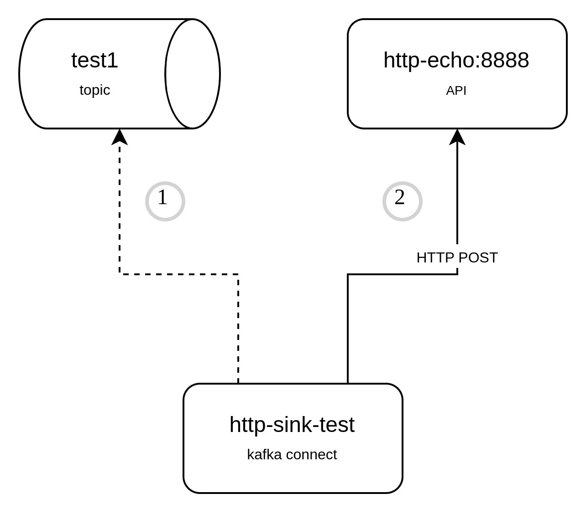
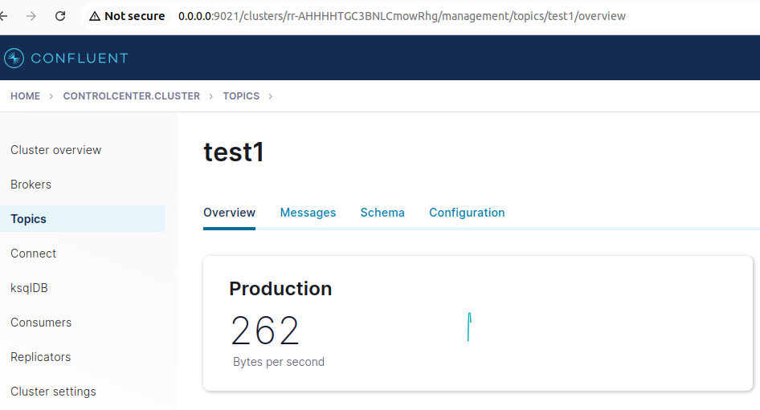
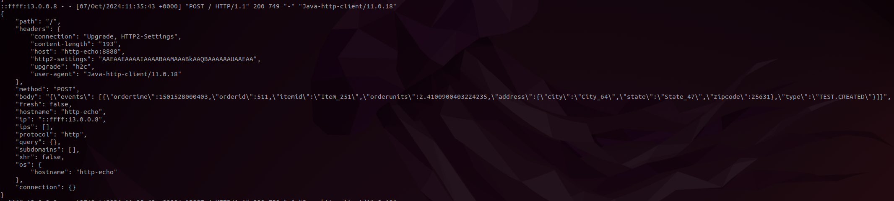

# kafka-connect-http-sink-example



1. Run with:
```shell script
docker-compose up -d
```
2. Wait 30 seconds to ksql-datagen generate messages at topic test1.

3. Make sure topic test1 has messages:


4. Create a connector http sink named http-sink-test:
```shell script
curl -X POST \
    -H "Content-Type: application/json" \
    -d @./docker/kafka-connector/connector-sink.json \
    http://0.0.0.0:8083/connectors
```

5. See messages arriving in batch from http post:
```shell script
docker logs -f http-echo
```


### Links:
1. https://github.com/Aiven-Open/http-connector-for-apache-kafka
2. https://aiven.io/docs/products/kafka/kafka-connect/howto/http-sink
3. https://docs.confluent.io/platform/current/connect/references/restapi.html
4. https://hub.docker.com/r/confluentinc/cp-kafka/
